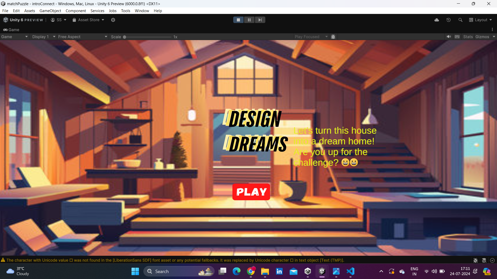
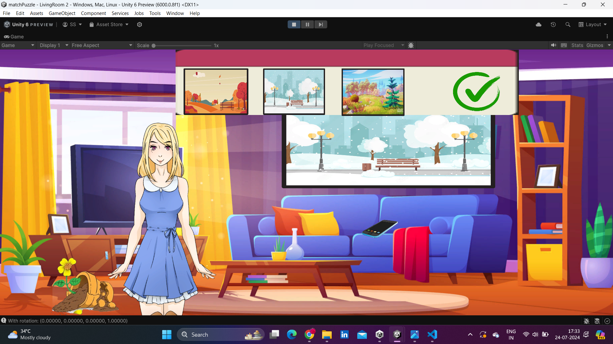
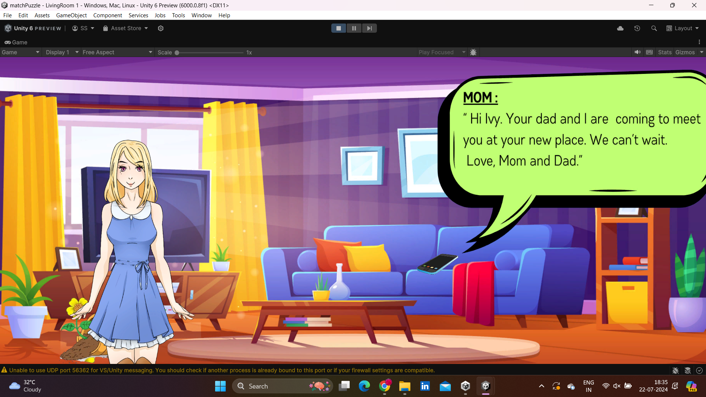
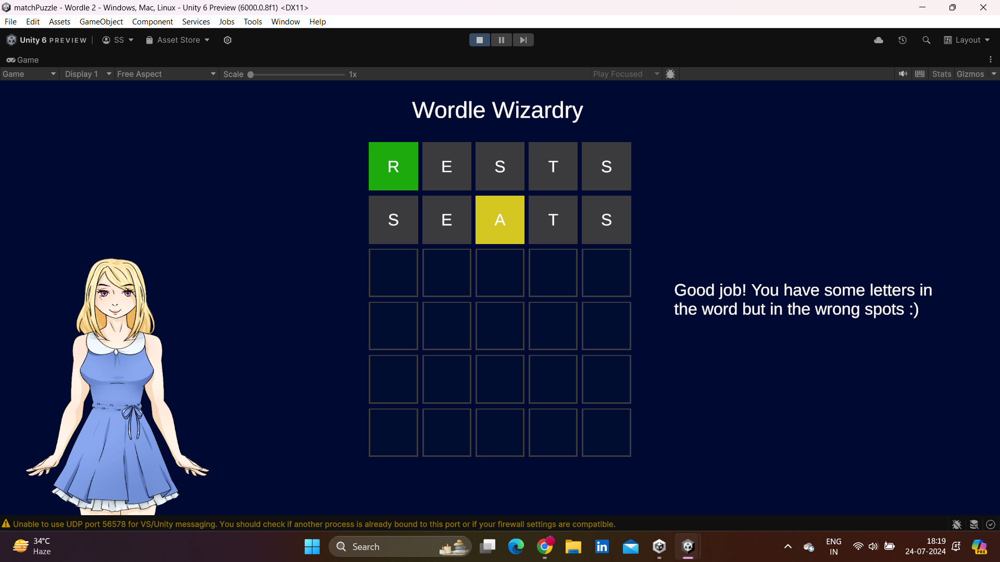
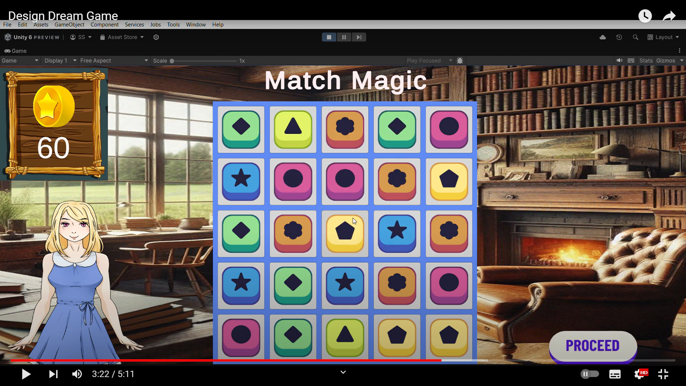

# Design Dream

## Overview

Welcome to **Design Dream**, an immersive and heartwarming game inspired by **Homescapes**. This game combines the excitement of puzzle-solving with the creativity of home decoration, all while following Ivy's journey to transform her house into a cozy, welcoming home before her parents visit.

## Storyline

Ivy's parents are coming to visit her for the first time in years, and she wants everything to be perfect. However, her house is far from ready. There are broken utensils, wobbly chairs, cracked tables, and a plethora of other problems that need fixing. Determined to make her home presentable, Ivy embarks on a mission to repair and furnish her house, one piece at a time.

## Gameplay

### Earn Points by Solving Puzzles

To help Ivy fix her house, players must earn points by solving various engaging and challenging puzzles. These puzzles include:

- **Wordle Wizardry**: Test your vocabulary and deduction skills by guessing the correct word within a limited number of attempts. Each successful word guessed earns points that can be used to repair and upgrade different parts of Ivy's home.

- **Match Magic**: Combine strategy and quick thinking to match three or more identical items in a row. Completing these puzzles rewards players with points and special bonuses to speed up Ivy's home improvement project.

### Home Decoration

As players accumulate points, they can choose which items to repair or purchase new furniture and decorations. The game features a range of customization options, allowing players to create a home that reflects their personal style while meeting Ivy's needs.

### Walkthrough

[Watch the walkthrough video](https://youtu.be/ee0m1sj10mU?si=jxq9xzwLz5aN0XXQ)

## Key Features

- **Engaging Puzzles**: Enjoy a variety of puzzles that challenge your mind and keep you entertained.
- **Creative Customization**: Decorate Ivy's home with a vast selection of furniture and decor items, ensuring each room is unique and inviting.
- **Heartwarming Storyline**: Follow Ivy's emotional journey as she reconnects with her parents through her efforts to create a perfect home.
- **Rewarding Progression**: Earn points and rewards for completing puzzles, making visible progress in the game's storyline and home improvement goals.

## Technical Details

### Object-Oriented Programming (OOP) Concepts

Design Dream serves as a comprehensive project for learning and applying Object-Oriented Programming (OOP) principles. Throughout the development process, key OOP concepts such as encapsulation, inheritance, and polymorphism are utilized to create a robust and maintainable codebase.

- **Encapsulation**: Classes are designed to encapsulate data and behavior, promoting a modular and organized code structure.
- **Inheritance**: Common behaviors are abstracted into base classes, allowing for code reuse and extension through derived classes.
- **Polymorphism**: Interfaces and abstract classes are employed to enable flexible and interchangeable implementations.

### C# and Unity Integration

This project emphasizes the practical application of C# in game development, leveraging Unity as the primary development engine.

- **Programming Language**: C#
  - C# is used for scripting game logic, managing game states, and handling user interactions.
- **Game Development Engine**: Unity
  - Unity provides a powerful platform for creating 2D and 3D games, offering features such as a physics engine, animation tools, and asset management.

### Tech Stack

- **Programming Language**: C#
- **Game Development Engine**: Unity

## Resources

- [Learning Unity](https://docs.unity3d.com/Manual/index.html)
- [Learning C#](https://docs.microsoft.com/en-us/dotnet/csharp/)

By working on Design Dream, we have not only created an enjoyable game but also deepened our understanding of object-oriented programming, honed our C# skills, and gained valuable experience with the Unity game development engine.
